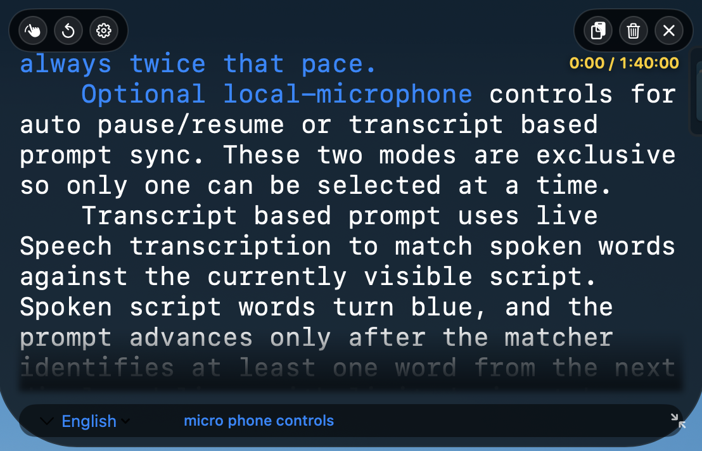
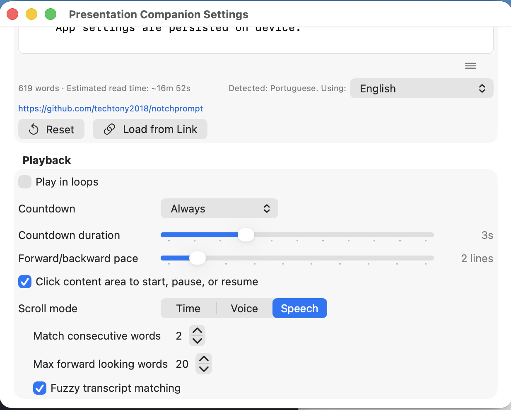
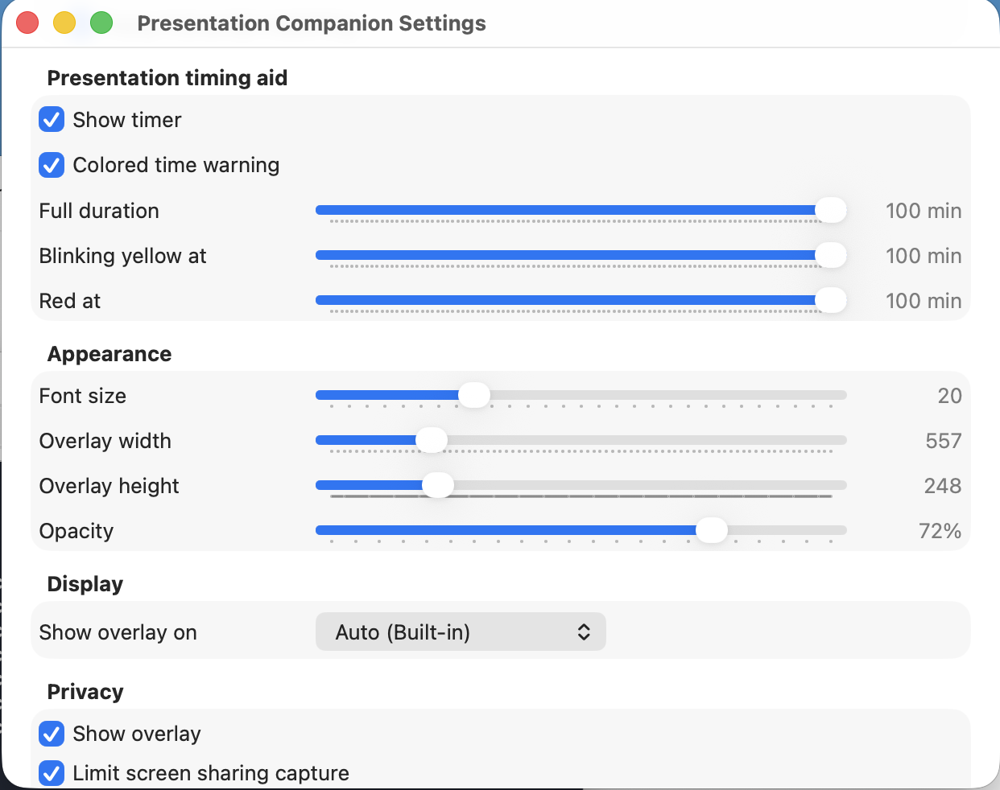
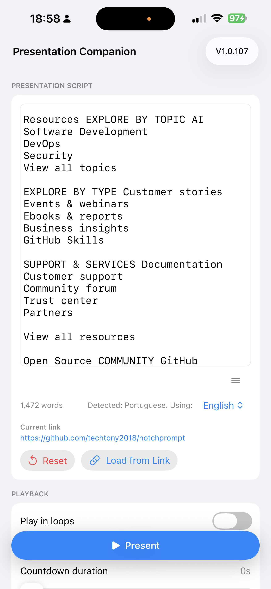
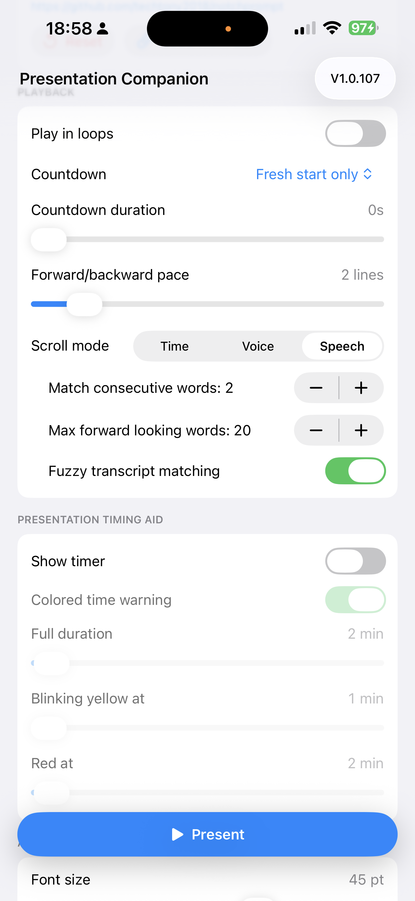
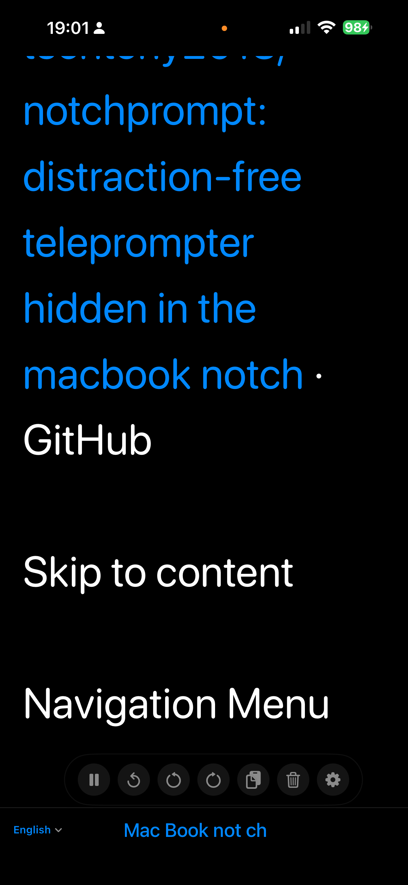

# Presentation Companion

<p align="center">
  
</p>

Native teleprompter companion for presentations and recordings. The macOS app
uses a notch-adjacent overlay, and the iOS app uses a full-screen in-app prompt
with the same core playback and voice controls.

## Quick Look



Presentation Companion keeps the prompt close to the camera, shows the active
timer, and keeps language or voice status pinned to the bottom status area.

## Features

### Shared

- Presentation Script editor in Settings, with a draggable height handle.
- Script word count in the editor.
- Load Link action that fetches an `http` or `https` article, strips HTML and Markdown tags, and loads the readable text into the script editor.
- Start/pause/resume controls, reset, and line-based forward/backward navigation.
- Configurable font size, countdown, scroll mode, play-in-loops behavior, and line-based forward/backward pace.
- Forward/backward moves by the configured line pace, defaulting to `2` displayed lines. Fast forward/backward is always twice that pace.
- `Scroll mode` groups the three mutually exclusive playback drivers: `Time`, `Voice`, and `Speech`.
- Time mode scrolls by seconds per displayed line. Fresh installs default to `5s/line`, and the current speed is shown in the prompt status area.
- Voice mode uses the local microphone to pause/resume based on the configured threshold.
- Speech mode uses live Speech transcription to match spoken words against the currently visible script.
- Transcript matching can require a configurable number of consecutive words before advancing, and optional fuzzy matching helps with recognition mistakes and accents.
- `Max forward looking words` limits how far ahead matching can search from the current progress anchor when that anchor is visible. If the anchor is no longer visible, matching reanchors to the beginning of the current prompt view.
- Spoken script words turn blue, and the prompt shifts only when the spoken progress reaches the lower part of the visible prompt, reducing distracting movement while presenting.
- Transcript speech recognition chooses a supported recognition language from the script text, and Settings lets you override the recognition language manually.
- Configurable voice detection threshold from `-70 dB` to `20 dB`, defaulting to `-30 dB`.
- Unified prompt status area: Time mode shows speed, Voice mode shows `Voice: xx dB` plus `talking` or `paused, talk to continue`, and Speech mode shows the recognition language plus the latest recognized words.
- In voice or transcript mode, fresh playback waits for speech before moving the prompt. Manual pause blocks voice/transcript-driven resume until the presenter explicitly resumes.
- Presentation timing aid with optional timer display, colored time warnings, a 5 Hz blinking yellow warning state, and red timeout state.
- Timer values start green, turn blinking yellow near the configured warning point, and turn red after the configured limit. The timer resets only when Reset is pressed.
- Version display in Settings.

### macOS

- Menu bar utility workflow (`PC` status item).
- Notch-adjacent floating overlay with transport and settings controls.
- Settings window title is `Presentation Companion Settings`.
- Click the left third of the script area to scroll back by the configured line pace; double-click to scroll back twice that pace.
- Click the middle third to start, pause, or resume.
- Click the right third to scroll forward by the configured line pace; double-click to scroll forward twice that pace.
- Adjustable overlay width, overlay height, and opacity.
- Movable transparent timer overlay inside the prompt window.
- Resize the prompt overlay directly with the bottom-right resize handle; the window recenters after resizing.
- Scroll direction follows the macOS Natural Scrolling system setting.
- Import/export plain text scripts.
- Voice-triggered resume is blocked after a mouse pause until you click to resume, so Q&A audio does not restart the script.
- Privacy mode (`NSWindow.SharingType`, best-effort/app-dependent).





### iOS

- Settings is the landing window; a floating `Present` button switches immediately into full-screen prompting.
- Native iOS Presentation Script editor supports normal editing, keyboard input, select all, copy, and paste. Tapping the title or using the keyboard Done control hides the keyboard.
- Full-screen prompt mode reserves top control space and a bottom status line, so prompt text does not overlap controls or recognition status in portrait or landscape.
- Prompt screen taps mirror the macOS click zones: left third jumps back, middle pauses/resumes, and right third jumps forward. Back and forward controls move by the configured line pace; double taps move twice that pace.
- Standalone prompt controls are grouped together and include play/pause, reset, back, forward, settings, paste, and clear.
- The settings button returns to Settings without stopping the presentation timer.
- Floating prompt controls can be moved so they do not block the camera view.
- Toolbar opacity controls the prompt button cluster opacity.
- Manual pause fades the script and shows `Presentation paused, click Play again to resume` with a play icon.
- Voice level is shown directly in the prompt as `Voice: xx dB` when voice pause/resume is enabled.
- When voice-driven pause/resume is enabled, a fresh start waits after countdown and shows `Start talking to move prompt forward`.
- App settings are persisted on device.







## Requirements

- macOS version supported by the current deployment target in
  `notchprompt.xcodeproj`.
- Apple Silicon or Intel Mac for the macOS app.
- iPhone or iPad running iOS 17 or later for the iOS app.

## Version

Current version: V1.0.113.

## Install (Recommended)

1. Open GitHub Releases:
   `https://github.com/techtony2018/notchprompt/releases`
2. Download the latest `.dmg` release asset.
3. Open the DMG and drag `Presentation Companion.app` to `Applications`.
4. Launch `Presentation Companion.app`.

### Unsigned Build Note

This build is currently unsigned/unnotarized, so macOS may show security prompts.

If macOS shows:

- `Apple could not verify "Presentation Companion" is free of malware...`
- or `"Presentation Companion" is damaged and can’t be opened`

run:

```bash
xattr -cr "/Applications/Presentation Companion.app"
open "/Applications/Presentation Companion.app"
```

If it is still blocked:

1. Open `System Settings -> Privacy & Security`.
2. Click **Open Anyway** for `Presentation Companion`.
3. Launch again.

## Keyboard Shortcuts

| Shortcut | Action |
| --- | --- |
| `⌥⌘P` | Start / Pause |
| `⌥⌘R` | Reset scroll |
| `⌥⌘J` | Jump back by the configured line pace |
| `⌥⌘H` | Toggle Privacy Mode |
| `⌥⌘O` | Toggle overlay visibility |
| `⌥⌘=` | Increase speed |
| `⌥⌘-` | Decrease speed |

## Build From Source

```bash
git clone https://github.com/techtony2018/notchprompt.git
cd notchprompt
open notchprompt.xcodeproj
```

CLI build:

```bash
xcodebuild -project notchprompt.xcodeproj -scheme notchprompt -configuration Debug build
xcodebuild -project notchprompt.xcodeproj -scheme "Presentation Companion" -configuration Debug -sdk iphonesimulator build
```

iPhone device build:

```bash
xcodebuild build -project notchprompt.xcodeproj -scheme "Presentation Companion" -configuration Debug -destination "platform=iOS,id=<device-udid>"
```

## License

MIT. See `LICENSE`.
